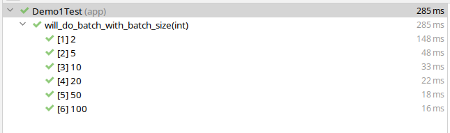
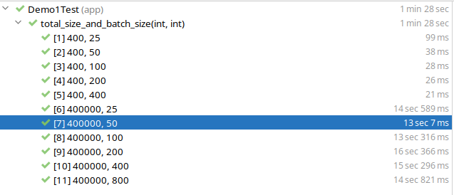
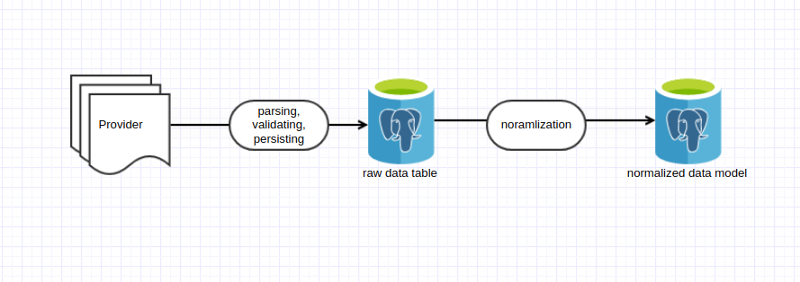

# Bulk data processing with PostgreSQL Thingy
## Introduction

At Swissquote, we provide access to over 50 stock markets, enabling seamless trading of more than four million products, including stocks, ETFs,
cryptocurrencies, FX, CFDs, funds, bonds, and more. However, behind this seamless trading experience lies a critical challenge: ensuring that the
fundamental data for these securities is accurate, up to date and properly structured.

This is where my team comes in. We serve as internal data providers, responsible for building and maintaining a robust data pipeline between
external data sources and our internal systems. The data we handle goes through several crucial stages:

- **Retrieval**: Gathering information from various external providers, often in high volume, bust mode and can be in different formats.
- **Validation**: Ensuring the data's accuracy, completeness, and consistency.
- **Normalization**: Converting and aligning the data with our internal formats and standards.
- **Storage**: Efficiently storing the data to make it readily accessible across the organization.
- **Delivery**: Distributing the data in various formats to meet the diverse needs of our internal consumers.

In this article, we will share our experience and lessons in building the Bulk Data Lakehouse system with many data intensive applications
doing bulk modifications, bulk internal identifier generation, and efficient data fetching.

In addition, at the end of the article, we will touch on our future vision for evolving this pipeline to meet the growing demands of our
organization.
We hope you'll join us on
this journey as we dive into the intricacies of building a high-performance data pipeline.

### Before we go: Run Docker Compose

Before running the tests, make sure to set up the necessary environment by running the following command in the root directory of the project:

```bash
docker-compose up -d
```

This will start the required PostgreSQL database in the background. Once the containers are running, you can proceed with all the demo tests.

## Bulk Data Modifications

In Hibernate, the default `session` type is a full session, which operates within a Persistence Context. The Persistence Context is a critical
part
of Hibernate’s caching mechanism, specifically designed to manage entities and their state during a session.

A `Persistence Context` maintains a first-level cache where Hibernate stores entities that are being tracked. This allows Hibernate to manage
entity state transitions automatically and reduces the need to constantly access the database. For example, when a session retrieves an entity,
it is stored in this cache, and subsequent requests for the same entity are served directly from the first-level cache rather than hitting the
database again.

The Persistence Context also plays a key role in automatic dirty checking—an optimization that tracks changes to entity states and updates the
database only when necessary. This can be highly efficient in environments where fine-grained operations are common, as it minimizes unnecessary
database operations and improves overall performance in scenarios where frequent reads and writes occur.

However, while this works well for many transactional operations, it may introduce performance bottlenecks when dealing with large-scale bulk
operations. Managing the state of each entity in memory can lead to significant overhead, and automatic dirty checking might not always be
necessary when we’re simply inserting or updating large datasets.

These features make StatelessSessions more efficient for handling large data volumes without significant memory consumption, making them ideal
for bulk processing tasks.

## Enabling JDBC Statement Batching for StatelessSessions

When using a StatelessSession compared to a traditional session, we indeed save memory by avoiding the persistence context, first-level caching,
and dirty checking. This makes it ideal for bulk operations where tracking the state of each entity is unnecessary. However, memory optimization
is just one aspect of improving performance. A critical factor in overall performance is the cost of database roundtrips, which can significantly
impact throughput in large-scale data operations.

Each time the application interacts with the database, a roundtrip is required. If each operation (such as an insert, update, or delete) involves
a separate database call, the latency introduced by these roundtrips can accumulate, especially when handling bulk operations. This can become a
bottleneck, even if memory usage is optimized.

This is where JDBC batching plays a crucial role. JDBC batching allows multiple SQL statements to be grouped into a single database call,
reducing the number of roundtrips and minimizing network overhead. By sending several operations in one batch, the time spent waiting for
responses from the database is significantly reduced, resulting in better overall throughput.

JDBC batching works for both normal sessions and StatelessSessions. By default, StatelessSessions will execute each operation immediately as SQL
against the database. After JDBC batching is enabled, SQL operations can be queued into batches. These batches are executed either when the batch
size limit is reached or when the transaction is committed.

JDBC batching is typically disabled by default in many JDBC drivers. Batching can introduce
complexity, particularly in terms of error handling and transaction management, which might not be desirable for every application.

### Enable JDBC batching

Enabling JDBC statement batching can be done globally or at the session level.

1. Set the global batch size in your configuration:

```properties
hibernate.jdbc.batch_size=20
```

2. Set batch size in the session level (since Hibernate 5.2):

```java
Session session = sessionFactory.openStatelessSession(); 

setJdbcBatchSize(50); // Overrides global batch size for this session
```

To demonstrate the impact of batch size, let’s walk through a demo using in-session batch size configuration.

Imagine we have a simple class called `Cat`, which includes an `Id` column with UUIDv6 type. PostgreSQL 
provides a native UUID data type for efficient storage. Hibernate has supported the mapping of `java.util.UUID` to the PostgreSQL UUID type since version
5.0, and it offers various UUID generation strategies. In this example, we will not use Hibernate's default UUID generation from 
`@GeneratedValue` but from [uuid-creator](https://github.com/f4b6a3/uuid-creator).

> UUIDv4 as a primary key will cause index fragmentation. For PostgreSQL, it's beeter to use UUIDv6.  

```java
@Getter
@Setter
@NoArgsConstructor
@Entity
public class Cat {
	@Id
	private UUID catId;
	private String name;

	public Cat(String name) {
		this.catId = UuidCreator.getTimeOrdered();
		this.name = name;
	}
}
```

Now, we build a cat factory to create cats one by one without batching, or create cats in batches. 

```java

public void createCatsInBatches(int total, int batchSize) {
	List<Cat> uuidEntityList = IntStream.range(1, total + 1)
			.mapToObj(integer -> new Cat(generateRandomString())).toList();
	try (StatelessSession statelessSession = sessionFactory.openStatelessSession()) {
		statelessSession.setJdbcBatchSize(batchSize);
		Transaction transaction = statelessSession.beginTransaction();
		uuidEntityList.forEach(statelessSession::insert);
		transaction.commit();
	}
}

public void createCatsOneByOne(int total) {
	List<Cat> uuidEntityList = IntStream.range(1, total + 1)
			.mapToObj(integer -> new Cat(generateRandomString())).toList();
	sessionFactory.inStatelessTransaction(statelessSession -> uuidEntityList.forEach(statelessSession::insert));
}
```

To verify whether JDBC batching is actually being applied, I use a handy but somewhat lesser-known open-source framework
called [Datasource Proxy](https://github.com/ttddyy/datasource-proxy-examples). This tool provides detailed output of the exact queries executed,
including batch size information.

Next, let's create a parameterized JUnit test to observe how batching works in practice for our specific task.

```java

@Test
void create_400_cats_with_batch_size_diff_transactions() {
	sut.createCatsBatchingInSmallerTransaction(400, 10);
}

@ParameterizedTest
@ValueSource(ints = {2, 5, 10, 20, 50, 100})
void create_400_cats_with_batch_size(int batchSize) {
	sut.createCatsInBatches(400, batchSize);
}

```

Running the tests will show us that when JDBC batching is not enabled, each insert operation is executed immediately, one by one.

```log
[25/08/24 06:52:48.127] INFO  [main] [] [SLF4JQueryLoggingListener] 
Name:, Connection:4, Time:1, Success:True
Type:Prepared, Batch:False, QuerySize:1, BatchSize:0
Query:["insert into TestClassA (text, uuid) values (?, ?)"]
Params:[(random_text, uuid)]
```

However, when we specify a JDBC batch size, the inserts are grouped and executed in batches according to the configuration, which can
significantly improve performance.

```log
[25/08/24 07:08:54.845] INFO  [main] [] [SLF4JQueryLoggingListener] 
Name:, Connection:6, Time:1, Success:True
Type:Prepared, Batch:True, QuerySize:1, BatchSize:5
Query:["insert into TestClassA (text, uuid) values (?, ?)"]
Params:[(random_text, uuid), ...]
```

### Choosing a Proper Batch Size



In the previous example, we observed that different batch sizes impact the total execution time. But is a larger batch size always better?

### Considerations for Larger Batch Sizes:

1. **Memory Usage**:
   Larger batches require more memory on the database side. If your database is under heavy load, large batches can lead to resource contention
   and slow down performance. On the application side, batching uses memory to store operations until they’re executed. If the batch size is too
   large, you could encounter `OutOfMemoryError` issues or increase memory pressure on your JVM.

2. **Error Handling**:  
   Handling errors with larger batches is more challenging. If a batch fails, rolling back a large number of operations can be time-consuming and
   add complexity. For example, if you have a batch size of 1000 and a failure occurs on the 999th operation, you may need to handle partial
   commits or selectively retry failed operations.

3. **Operation Type**:  
   Larger batch sizes generally perform well for **insert** operations, which are straightforward and independent. However, for **update** or
   **delete** operations, which often involve indexes or constraints, smaller batch sizes could be more effective to avoid locking issues or
   reduce database load.

4. **Data Size and Variability**:  
   If the size of the data varies significantly (e.g., inserting large BLOBs), larger batch sizes might lead to uneven performance. It’s often
   better to choose a batch size that balances the processing of both large and small data efficiently.

### Testing and Profiling:

The best way to determine the optimal batch size is through performance testing and profiling in an environment that closely mirrors your
production setup. By testing different configurations, you can gain insight into how batch sizes impact both application and database
performance.

Let’s try this with a simple JUnit test.
After running several rounds of tests with varying parameters, we notice that increasing the batch size
beyond a certain point no longer significantly reduces the overall application execution time.
While the throughput remains relatively stable,
further increasing the batch size shows diminishing returns.



This outcome isn’t surprising. When batches are large enough, and the dataset is significant, the process becomes more limited by the
actual I/O of the insert operations. As a result, performance stabilizes regardless of further increases in batch size.

Additionally, inserting everything in a single transaction is often discouraged. If the transaction fails, the amount of work lost is
significant, so balancing batch size with transaction safety is key.

### Situations Where Batching Won’t Occur, Even If Enabled

Even when batching is enabled, certain pitfalls can prevent it from working as expected.

#### Auto-Increment Columns and Primary Key Generation

Using `IDENTITY` for ID generation prevents batching because IDs must be generated immediately after each insert. To demonstrate the impact of
different generation strategies on batching, let's test it with the following entities:

```java

@NoArgsConstructor
@Entity
public class MessageIdentity implements Message {

	@Id
	@GeneratedValue(strategy = GenerationType.IDENTITY)
	private Long id;
	private String text;

	public MessageIdentity(String text) {
		this.text = text;
	}
}

@NoArgsConstructor
@Entity
public class MessageSequence implements Message {

	@Id
	@GeneratedValue(strategy = GenerationType.SEQUENCE, generator = "message_seq")
	@SequenceGenerator(name = "message_seq", sequenceName = "message_seq", allocationSize = 100) // default is 50
	private Long id;
	private String text;

	public MessageSequence(String text) {
		this.text = text;
	}
}

@NoArgsConstructor
@Entity
public class MessageAuto implements Message {

	@Id
	@GeneratedValue
	private Long id;
	private final String text;

	public MessageAuto(String text) {
		this.text = text;
	}
}
```

The following method generates a `Message` object based on the specified `GenerationType` (e.g., `IDENTITY`, `AUTO`, or `SEQUENCE`). It uses a
concise switch expression to create different message entity types with randomly generated content.

```java
public static Message generateMessageByType(GenerationType type) {
	log.info("Message generated");
	return switch (type) {
		case IDENTITY -> new MessageIdentity(generateRandomMessage());
		case AUTO -> new MessageAuto(generateRandomMessage());
		case SEQUENCE -> new MessageSequence(generateRandomMessage());
		default -> null;
	};
}
```

Now let's set up a simple Junit parameterized tests to see how the execution time varies.

```java
class TestDifferentGenerationType {
	private static final int DEFAULT_MESSAGE_SIZE = 4_000;

	private static PostgresBulkInsert sut;

	@BeforeAll
	static void setUpBeforeClass() {
		ApplicationContext context = new AnnotationConfigApplicationContext(AppConfig.class);
		sut = context.getBean(PostgresBulkInsert.class);
	}

	@ParameterizedTest
	@ValueSource(ints = {1, 5, 10, 20, 50, 100})
	void compare_batch_size_for_sequence(int batchSize) {
		sut.populateInSingleTransaction(DEFAULT_MESSAGE_SIZE, batchSize, GenerationType.SEQUENCE);
	}

	@ParameterizedTest
	@ValueSource(ints = {1, 5, 10, 20, 50, 100})
	void compare_batch_size_for_identity(int batchSize) {
		sut.populateInSingleTransaction(DEFAULT_MESSAGE_SIZE, batchSize, GenerationType.IDENTITY);
	}
}
```

Running this test will easily show that the `IDENTITY` generation strategy impacts batching. No matter the batch size, the `IDENTITY` strategy
prevents batching from being effective.

#### Batching with Different SQL Statements

JDBC batching, which Hibernate relies on under the hood, doesn't batch all operations automatically. JDBC batching works by sending multiple
executions of the same SQL statement in a single batch to the database. When we work with different entities or perform several `INSERT`
operations followed by `UPDATE` or `DELETE` operations within the same session, JDBC won’t group them into a single batch.

Let’s also do a simple test to see this in action. First, let’s create two testing entities:

```java

@NoArgsConstructor
@AllArgsConstructor
@Entity
public class TestClassA {
	@Id
	private String uuid;
	private String text;

}

@NoArgsConstructor
@AllArgsConstructor
@Entity
public class TestClassB {
	@Id
	private String uuid;
	private String text;

}
```

To separate different concerns, we don't use Hibernate generation strategy for the ID column. Instead, we manually generate the UUID string in
the app.

```java
public void populateWithMixedStatementsNoBatch(int total, int batchSize) {
	List<TestClassA> uuidEntityList = IntStream.range(1, total + 1)
			.mapToObj(integer -> new TestClassA(UUID.randomUUID().toString(), generateRandomMessage())).toList();
	List<TestClassB> intIdEntityList = IntStream.range(1, total + 1)
			.mapToObj(integer -> new TestClassB(UUID.randomUUID().toString(), generateRandomMessage())).toList();
	sessionFactory.inStatelessTransaction(statelessSession -> {
		statelessSession.setJdbcBatchSize(batchSize);
		for (int i = 0; i < total; i++) {
			statelessSession.insert(uuidEntityList.get(i));
			statelessSession.insert(intIdEntityList.get(i));
		}

	});
}
```

Here, we create two lists of TestClassA and TestClassB, and insert them in a single transaction using a mixed DML (Data Manipulation Language)
statement approach. Even though JDBC batching is enabled, we can see from the logs that the batch size is always 1. This happens because JDBC
only batches identical SQL statements, and mixing different statements (e.g., inserting into different tables) interrupts batching.

Thanks to Datasource Proxy, we can clearly observe that with PostgreSQL, batching occurs, but the batch size remains 1 for each statement due to
the mixed nature of the SQL commands.

```log
[23/08/24 09:46:34.631] INFO  [main] [] [SLF4JQueryLoggingListener] 
Name:, Connection:4, Time:0, Success:True
Type:Prepared, Batch:True, QuerySize:1, BatchSize:1
Query:["
    insert 
    into
        TestClassA
        (text, uuid) 
    values
        (?, ?)"]
Params:[(yEsQ6KUW7bfvaq3jlEMgVwjMEVfBalze2dyM4zYB1ynexi3ZndCIxnU1BxMR1a3JDUlrzRlnQXIZzj7t3rqDpXRqJ8ZAXFz4hRsl,feb2021c-7874-4f3a-a01d-48eb0215f73a)]
[23/08/24 09:46:34.632] INFO  [main] [] [SLF4JQueryLoggingListener] 
Name:, Connection:4, Time:0, Success:True
Type:Prepared, Batch:True, QuerySize:1, BatchSize:1
Query:["
    insert 
    into
        TestClassB
        (text, uuid) 
    values
        (?, ?)"]
Params:[(ndQfiomw0BeqgchSx2nCPDZD4Q3LCnIeeFJnbDpkEjkD1ykGEJQnqgnjq5qIH0RMP7qga4wnd0adOrOR0D1hgQ55j37jjqduLTVM,1225816f-6a00-459e-8ded-152321d3c0b2)]

```

Takeaways from this section:

> **Key 1:** Batching is ineffective with the `IDENTITY` generation strategy.
>
> **Key 2:** Batching is ineffective if DML statements are mixed in your transaction.

## Avoiding long-running transactions to have one per batch(es) 

So far, we wrap all inserts in a single transaction. Though we could benefit from fewer commits, we put more memory
pressure on the database server. A long-running-transaction will impact the database server due to extended locks and transaction logs.

Instead, we recommend wrapping each batch in its own transactions like below.

```java
    public void populateTestClassAListWithBatching(int total, int batchSize) {
	// Prepare the insert list
	List<TestClassA> toInsertList = IntStream.range(0, total)
			.mapToObj(integer -> new TestClassA(generateRandomMessage())).toList();
	// Calculate the number of transactions
	int count = (total + batchSize) / batchSize;
	try (StatelessSession statelessSession = sessionFactory.openStatelessSession()) {
		statelessSession.setJdbcBatchSize(batchSize);
		for (int i = 0; i < count; i++) {
			// start and end index to fetch the corresponding entries to insert
			int startIndex = i * batchSize;
			int endIndex = Math.min(startIndex + batchSize, total);
			statelessSession.beginTransaction();
			for (int j = startIndex; j < endIndex; j++) {
				statelessSession.insert(toInsertList.get(j));
			}
			statelessSession.getTransaction().commit();

		}

	}
}

```

## Batch natural identifiers generation with sequences

An ISIN (International Securities Identification Number) is a unique 12-character alphanumeric code that identifies specific financial
securities, such as stocks, bonds, and other tradable financial instruments, globally. It is used as a standardized identifier to ensure
consistency across various markets and financial systems.

At Swissquote, we use ISIN as the natural ID for our tradable products. However, not all financial products are assigned ISINs. Options, futures,
swaps, and other over-the-counter derivatives typically don’t have ISINs. Similarly, commodities (e.g., gold, oil) and currencies are also
excluded.

To provide a consistent financial identifier, we generate ISIN-format identifiers for all of our financial products. We have key considerations
and requirements for these generated ISIN identifiers:

- **Global Uniqueness**: Each identifier should be globally unique within our system. No two options or futures contracts should ever share the
  same identifier.
- **Avoid Collisions**: Ensure that our internal ISINs don’t conflict with real ISINs.
- **Concurrency Control**: ISINs can be generated by multiple applications, so consistency, uniqueness, and concurrency control are crucial.
- **Idempotency**: Ensure that ISIN generation is idempotent. If the same request is processed more than once due to retries, the system should
  return the same ISIN without duplicating or generating multiple IDs for the same request.

Among all possible solutions, we chose to use a sequence and a mapping table in PostgreSQL to achieve this. The details of the generator could
easily fill another blog, but here we’d like to focus on the sequence generation aspect.

In previous examples, we’ve seen `@GeneratedValue` with the `GenerationType.SEQUENCE`. However, in reality, we seldom use it because of the
potential mismatch between the allocation size and the actual increment value of the database sequence. This mismatch can lead to significant
issues in the application.

Inserted, we use `generate_series` to effectively prefetch multiple sequence values in a single query. This simulates the batch fetching
behavior that Hibernate implements with `allocationSize`, but we always maintain `INCREMENT BY 1`.

```SQL
SELECT nextval('sequence_name') as val
FROM generate_series(1, num);
```

In the generator, after fetching the required NUM sequence values, we map them to ISIN-format identifiers and assign each one uniquely to the
business key of the corresponding financial product. The mapping table ensures global uniqueness and handles collision detection, while the
PostgreSQL sequence mechanism effectively manages concurrency control. For idempotency, the unique identification of financial products by their
business keys guarantees that the same request will always return the same ISIN. As a result, all four of our key requirements—global uniqueness,
collision avoidance, concurrency control, and idempotency—are met.

## Query streaming, Reactive programming and Chronicle API

A simplified version of our data flow can be visualized as follows:



Up to this point, we’ve mainly discussed integration provider data and persisting it into the database. However, after storing raw provider
data into our first data layer,
we need to normalize it and persist the results into the second data layer. The reason for having two layers is not only to separate the concerns
between external provider protocols and the general normalization process, improving system scalability, but also to enhance auditability and
support data quality investigations.

A critical part of the process from data layer 1 to data layer 2 is streaming data from the first layer's database. We use reactive programming
to build our data flow.
Starting with an in-house streaming solution in the earlier years, we transitioned to RxJava around 2018, and
we’re now adopting the Reactor project as part of our tech stack.

Below is a simplified example of how a data producer might look like:

```java
public class EntityProducer {

	private final SessionFactory sessionFactory;

	public Flux<TestClassA> publish() {
		return Flux.using(sessionFactory::openStatelessSession, this::streamData, StatelessSession::close);

	}

	private Publisher<TestClassA> streamData(StatelessSession session) {
		String hql = "from TestClassA";
		Query<TestClassA> query = session.createQuery(hql, TestClassA.class);
		return Flux.fromStream(query.stream());
	}

}
```

In this example, we use `Query.stream()` to stream data from the database. The `Flux.using` construct ensures that a StatelessSession is opened
for the operation and properly closed when the stream completes. This approach allows us to efficiently stream data from the first data layer,
process it, and eventually persist it into the second layer in a reactive manner.
> Query.stream() method was introduced in Hibernate 5.2 as part of the support for Java 8's streaming capabilities. This method allows for lazy
> retrieval of entities as a Java stream, making it more efficient when working with large result sets by consuming them one by one rather than
> loading all of them into memory at once.

After the **producer** step, the data passes through various mappers and processing stages, all built using the **Reactor framework**. While we
won’t dive into Reactor in this article, it plays a critical role in transforming and processing the data as it moves through the pipeline.

At the end of the data pipeline, we persist the processed data again, similar to what we’ve discussed earlier in terms of using optimized tactics
like **StatelessSessions** and **JDBC batching**. This ensures that, even during the final persistence step, we maintain high performance and
efficiency across large-scale data operations.
Here’s an enhanced version of that section with additional explanation:

### The Memory and Long-Running Transaction Pitfall and Our Trial with Chronicle API

#### Something Went Wrong

Everything seemed perfect until one day our DBA raised a concern about long-running database connections stuck in the **`idle in transaction`**
state. This status indicates that a transaction has been opened but hasn't been committed or rolled back, leading to several critical
consequences in PostgreSQL.

**The Cruel Consequences:**

- **Connection Pool Exhaustion**: Idle connections in a transaction state consume valuable database resources. We had too many connections stuck
  in this state, leading to connection pool exhaustion and limiting the number of active connections available to the application.
- **VACUUM Delays**: PostgreSQL relies on the **VACUUM** process to reclaim storage and maintain performance by cleaning up dead tuples.
  Long-running transactions can block **VACUUM** from clearing old rows, leading to **table bloat**, which degrades performance as the database
  grows unnecessarily large.
- **Transaction ID Wraparound**: PostgreSQL assigns a unique transaction ID (XID) for every transaction. When a transaction remains open for too
  long, it delays the advancement of the **transaction ID** counter, potentially leading to **transaction ID wraparound** issues. In extreme
  cases, PostgreSQL may need to pause normal operations to avoid data corruption, which can severely impact database availability.

We essentially hit all the textbook warnings about long-running transactions.

**App's Memory Issues**

The database wasn't the only issue. Our IT team also flagged unusually high memory consumption in our applications. This puzzled us since, on the
surface, everything seemed to be working correctly in our code.

#### Investigation and Solution

Upon investigation, we identified both a bug and a design flaw in our data flow.

The default behavior of PostgreSQL JDBC drivers is to fetch all query results at once, which can cause memory issues when dealing with large
datasets. However, JDBC provides a way to mitigate this by using a **database cursor** to fetch results in smaller batches. In Hibernate,
the `Query.stream()` method is based on a scrollable `ResultSet` that internally uses a database cursor, but to control the size of each batch of
fetched results, you need to set the **fetch size**.

Here’s the corrected code:

```java

@RequiredArgsConstructor
@Slf4j
public class EntityProducer {

	private final SessionFactory sessionFactory;

	public Flux<TestClassA> publish() {
		return Flux.using(sessionFactory::openStatelessSession, this::streamData, StatelessSession::close);
	}

	private Publisher<TestClassA> streamData(StatelessSession session) {
		String hql = "from TestClassA";
		Query<TestClassA> query = session.createQuery(hql, TestClassA.class).setFetchSize(10); // Set fetch size here 
		return Flux.fromStream(query.stream());
	}
}
```

Adding the fetch size helped reduce memory consumption in our application. However, we were still encountering the long-running transaction
issue. Why?

The root of the problem lies in the streaming process: the transaction remains open as long as the producer is actively streaming data. Until all
streaming is complete and the downstream finishes processing, the transaction stays open.

Unfortunately, downstream processing can take time. In some cases, we perform third-party HTTP calls to fetch external data, and we also need to
persist the results to the target data source. These operations can extend the life of the transaction, which is difficult to avoid given our
current design.

#### Chronicle API to the Rescue

This is where the **Chronicle API** comes to the rescue.

While a full introduction to the Chronicle API is beyond the scope of this discussion, here's what we did: we modified the flow to stream data
directly into an **off-heap map** provided by the Chronicle API. Once the producer finishes populating the map, we close the transaction. The
downstream consumers then access the data from the off-heap map, allowing us to avoid long-running transactions. This solution is fast and
efficient, ensuring that our transactions are kept short while maintaining the integrity of our data flow.

## Future Work: PgBouncer and Kafka Connect

As part of our ongoing efforts to optimize our infrastructure, we are conducting a proof of concept (PoC) with **PgBouncer** and
**Kafka Connect** to further enhance our data pipeline's efficiency and scalability.

### PgBouncer for Connection Pooling

One of the challenges we face is managing a large number of concurrent database connections, particularly during peak load times. **PgBouncer**,
a lightweight connection pooler for PostgreSQL, can help alleviate connection pool exhaustion by efficiently managing and recycling connections.
By minimizing the overhead of establishing and closing database connections, PgBouncer can enhance database performance and reduce the total
number of active connections required by our high-throughput applications.

In our PoC, we are evaluating PgBouncer's impact on improving connection handling efficiency, especially in scenarios involving long-running
transactions or bursts of concurrent requests. Early results show a significant reduction in connection overhead, and we plan to integrate
PgBouncer into our production environment soon to help manage our growing system demands.

### Kafka Connect for Streaming Data Integration

We are also exploring **Kafka Connect** to simplify and enhance the way we handle streaming data between our data layers. Kafka Connect is a
robust platform for building real-time streaming data pipelines, and it can help us replace some of our custom streaming solutions. By
integrating Kafka Connect, we aim to standardize and simplify data movement between layers, improving fault tolerance, scalability, and overall
system reliability.

Our PoC with Kafka Connect is focused on connecting our normalized data layer to external services and internal consumers. Its flexibility and
ability to scale data streaming across various external sources make Kafka Connect a promising candidate for enhancing the flexibility and
reliability of our pipeline.


## Conclusion

Building a highly efficient batch-processing data pipeline requires balancing memory usage, minimizing database roundtrips, and handling
transactions effectively. In this article, we explored the use of **Hibernate StatelessSessions**, **JDBC batching**, and **Query streaming** to
optimize the performance and throughput of large-scale data operations.

We also identified common pitfalls, such as long-running transactions and high memory consumption, and showed how adopting the **Chronicle API**
helped us address these issues by reducing transaction duration and offloading data to an off-heap map. These techniques have allowed us to
achieve greater scalability and improve the overall efficiency of our data pipeline.

Looking forward, we are excited to explore new technologies like **PgBouncer** and **Kafka Connect** in our proof of concept work. These tools
will help us further optimize connection management and data streaming, pushing the boundaries of our current infrastructure and positioning our
pipeline for future growth.


## References

- [The best size of batched inserts in PostgreSQL](https://stackoverflow.com/questions/49250849/the-best-size-of-batched-inserts-in-postgresql)
- [PostgreSQL JDBC documentation](https://jdbc.postgresql.org/documentation/query/)

